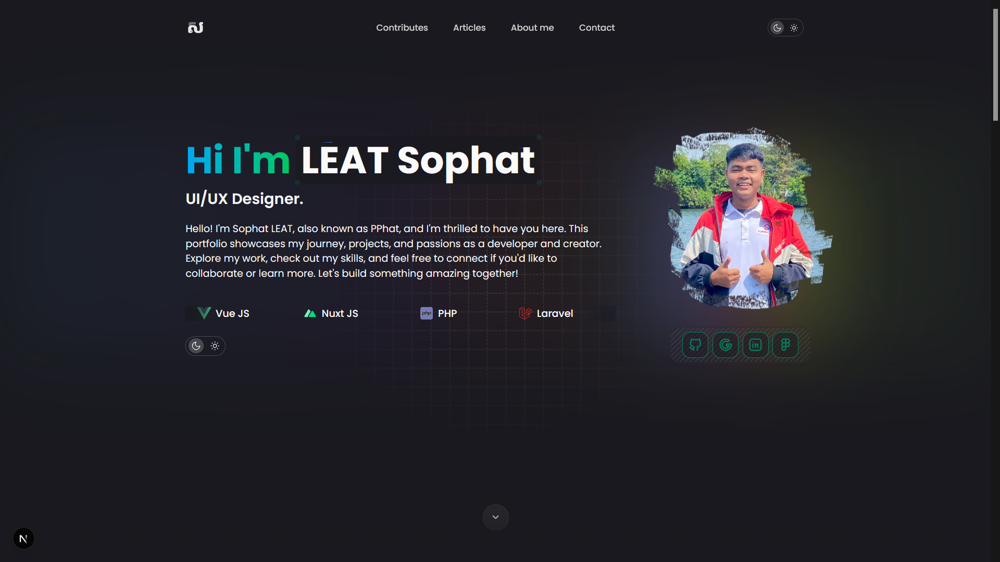

# 🚀 Installation

## Prerequisites
- Node.js (v18 or higher)
- npm or yarn package manager

## Setup Instructions

1. **Clone the repository**
```sh
git clone https://github.com/your-username/pphat.netlify.app.git
cd pphat.netlify.app
```

2. **Install dependencies**
```sh
npm install
```

3. **Set up environment variables**
```sh
cp .env.example .env.local
# Add your configuration values
```

4. **Start development server**
```sh
npm run dev
```

5. **Initialize the local SQLite database**
```sh
npm run db:sync
```

This project keeps posts and projects in `content/` markdown files. The SQLite database is used for queryable application data and mirrors content metadata for future features. Contact form submissions are stored directly in SQLite.

6. **Build for production**
```sh
npm run build
```

7. **Preview production build**
```sh
npm preview
```

## Database

- ORM: Drizzle
- Dialect: SQLite
- Default database path: `file:./data/pphat.sqlite`
- Schema file: `src/lib/db/schema.ts`
- Drizzle config: `drizzle.config.ts`

Useful commands:

```sh
npm run db:sync
npm run db:push
npm run db:studio
```

---

# 📊 Analytics

